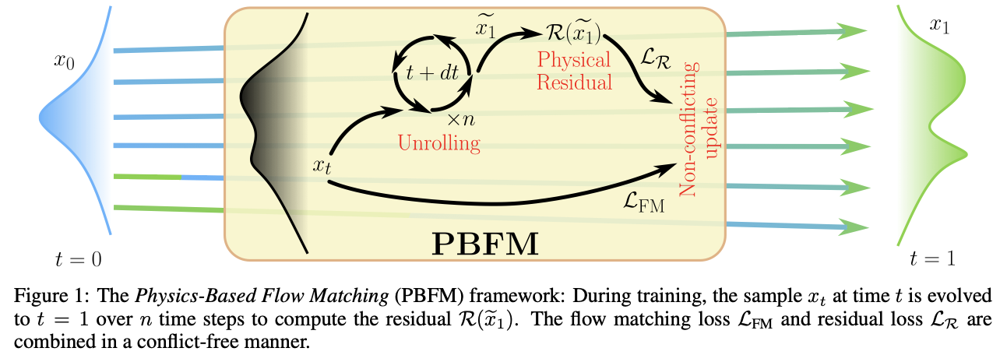
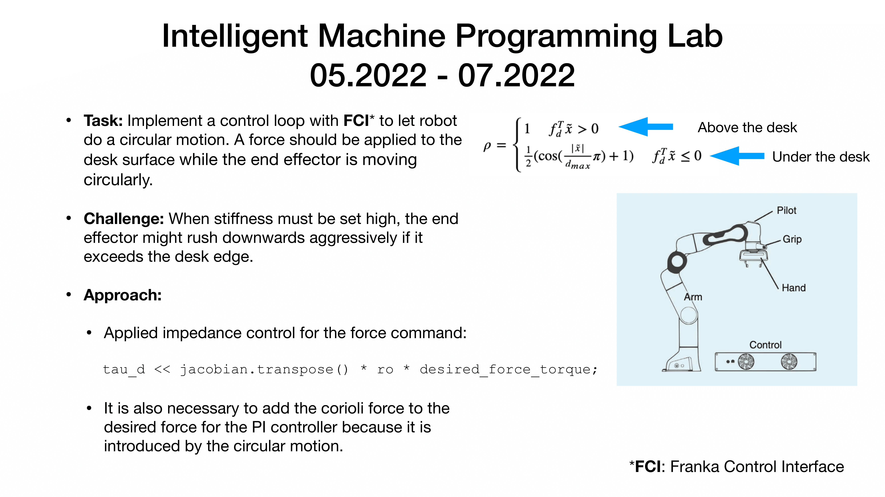

# PhysFMP  

**PhysFMP** is a framework for developing **physics-informed Flow-Matching policies** for robotics.  

Flow-Matching generative models naturally align with physics-informed learning since both are grounded in partial differential equations (PDEs). Recent works, such as:  

- [Physics-Constrained Flow Matching](https://arxiv.org/pdf/2506.04171v1)  
- [Flow Matching Meets PDEs](https://arxiv.org/pdf/2506.08604v1)  

have shown the potential of integrating physical constraints into Flow-Matching. However, these approaches have not yet been extended to **robot policy learning**.  

In real-world robotics, safety requires explicit physical constraints, which are commonly enforced through **tactile sensing** and **impedance control** to ensure compliant and safe interaction. Achieving such safety via trial-and-error approaches like reinforcement learning can be prohibitively costly on real robots, and both reinforcement learning and imitation learning often require a large number of demonstrations in simulation before reliable deployment on real machines, making them computationally expensive.  

**PhysFMP** addresses this challenge by embedding **impedance control** directly into Flow-Matching policies, enabling robots to perform tasks such as **sorting and pick-and-place in cluttered environments** while maintaining both safety and compliance.  

As illustrated in the framework proposed by Baldan et al. (June 2025) [Physics-Constrained Flow Matching](https://arxiv.org/pdf/2506.04171v1), Flow-Matching can be extended with PDE-based constraints:  

  

